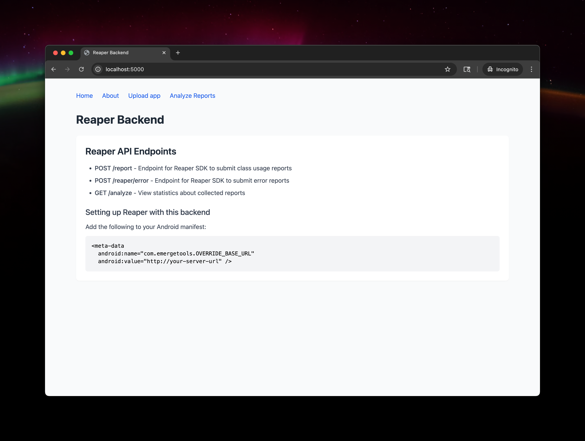
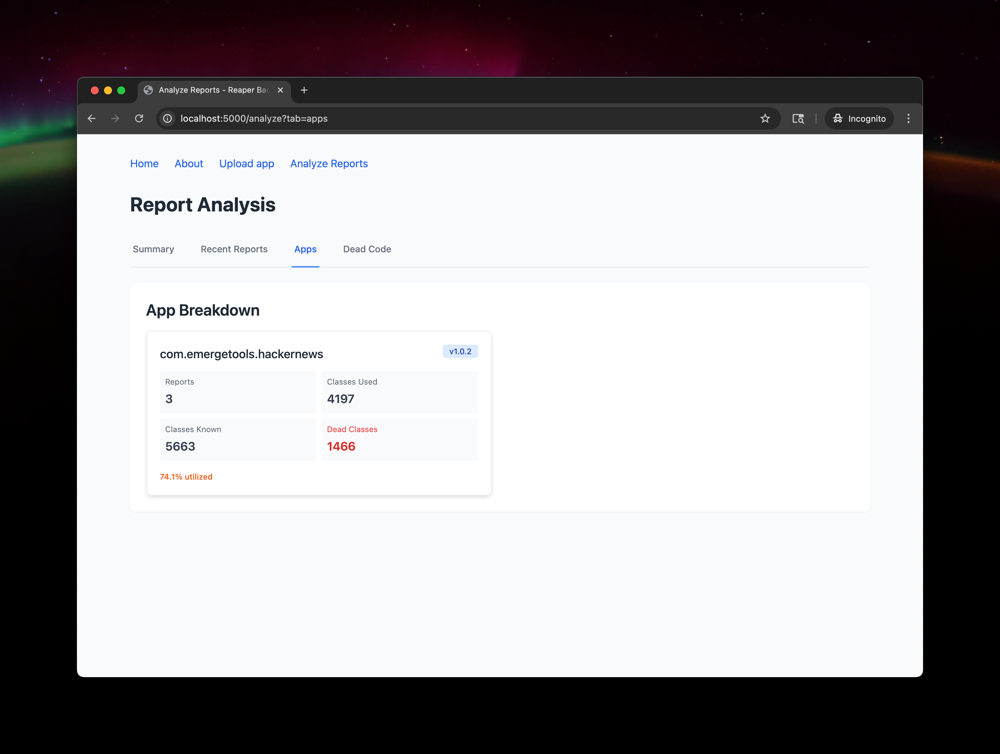
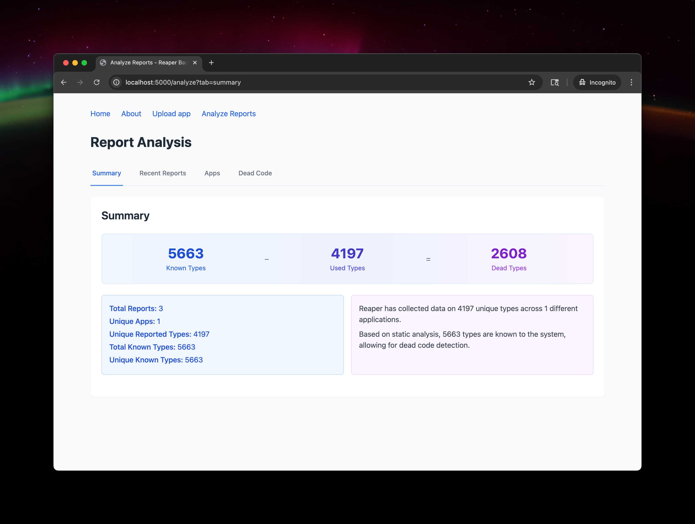
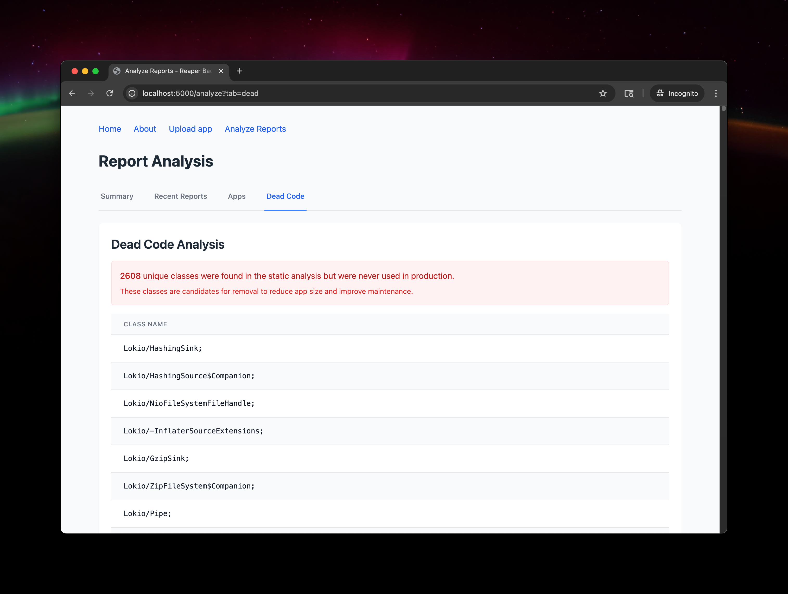

# Reaper: Dead Code Detection for Mobile Apps

Reaper is a tool for detecting dead code in mobile applications by combining static analysis with runtime data collection. Unlike traditional static analysis tools, Reaper uses data from production - allowing it to detect unused code which is impossible to detect via static approaches.

## How It Works

Reaper uses a two-step approach to identify dead code:

1. **Static Analysis**: Extracts all classes from your app binary (AAB for Android)
2. **Runtime Collection**: Collects data about which classes are actually used at runtime,

The difference between these sets represents code that is never used in production and can be removed.

### For Android Apps

On Android, Reaper:
- Computes the SHA256 hash of each class signature and extracts the top 64 bits
- Instruments the `<clinit>` (static initializer) and `<init>` (constructor) methods
- Collects and reports class usage data back to this backend

### For iOS Apps

On iOS, Reaper:
- Inspects the Objective-C and Swift runtime for metadata
- Uses the `RW_INITIALIZED` bit for Objective-C classes
- Uses runtime flags to detect accessed Swift types

## Features

- Upload Android App Bundles (AAB) for static analysis
- Automatically extracts package name and version information
- Collects and aggregates runtime data from mobile devices
- Visual dashboard for analyzing dead code metrics
- Detailed breakdown of unused classes
- Compare metrics across different app versions
- REST API for integration with CI/CD pipelines

## Getting Started

### Prerequisites

- Python 3.13+
- Flask
- Bundletool (for AAB processing)
- Baksmali (for DEX file disassembly)

### Installation

1. Clone the repository:
   ```bash
   git clone https://github.com/EmergeTools/oss-reaper.git
   cd oss-reaper
   ```

2. Install dependencies using `uv`:
   ```bash
   uv pip install -r requirements.txt
   ```

3. Run the development server:
   ```bash
   python app.py
   ```

4. Access the web interface at http://localhost:5000

## API Endpoints

### Report Class Usage

```
POST /report
```

Accepts JSON payload with the following structure:
```json
{
  "apiKey": "your_api_key",
  "seen": ["RvP1/Jw16IY=", ...],
  "platform": "android",
  "metadata": {
    "manufacturer": "Google",
    "model": "Pixel 7",
    "osVersion": "13",
    "reaperVersion": "1.0.2"
  },
  "appId": "com.example.app",
  "shortVersionString": "1.0.2"
}
```

### Report Errors

```
POST /reaper/error
```

Reports SDK errors back to the server.

## Integrating with Your App

### Android

Add the following to your Android manifest:

```xml
<meta-data
  android:name="com.emergetools.OVERRIDE_BASE_URL"
  android:value="https://your-server-url" />
```

## Running Static Analysis

To extract class signatures from an AAB file:

```bash
python reaper.py path/to/your/app.aab -o output.tsv
```

The output is a tab-separated file containing:
- Class signature
- SHA256 hash
- Base64-encoded top 64 bits
- Package name
- Version name

## Screenshots

### Home Screen


### Apps Analysis


### Summary Analysis


### Detailed Analysis


### Reports


## License

This project is licensed under the MIT License - see the LICENSE file for details.

